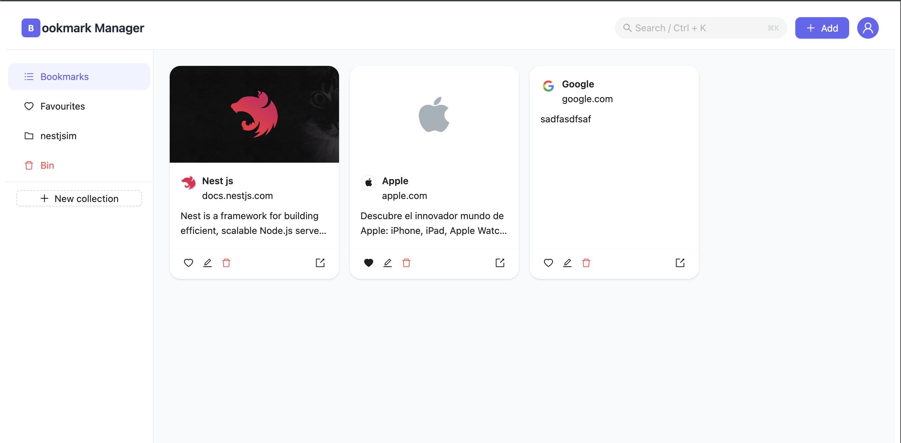
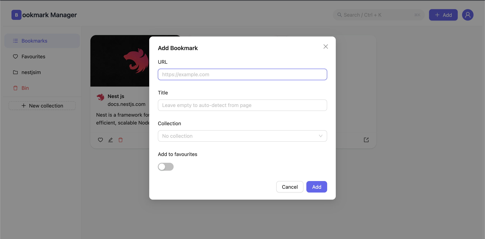
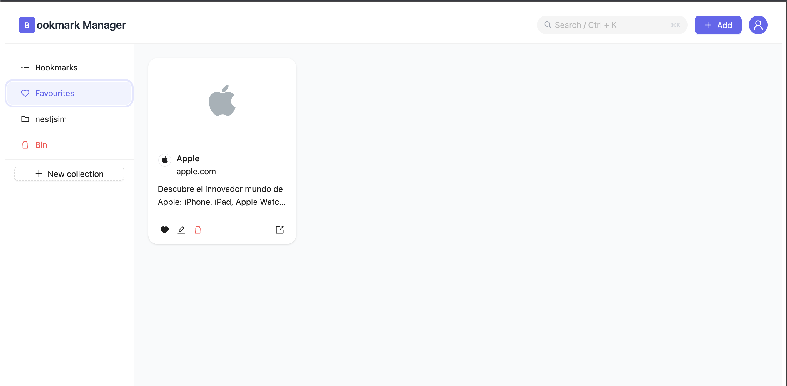
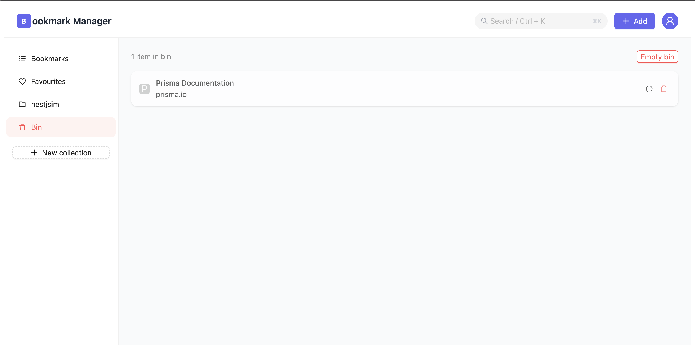
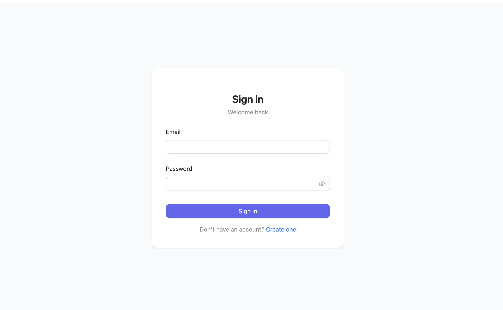
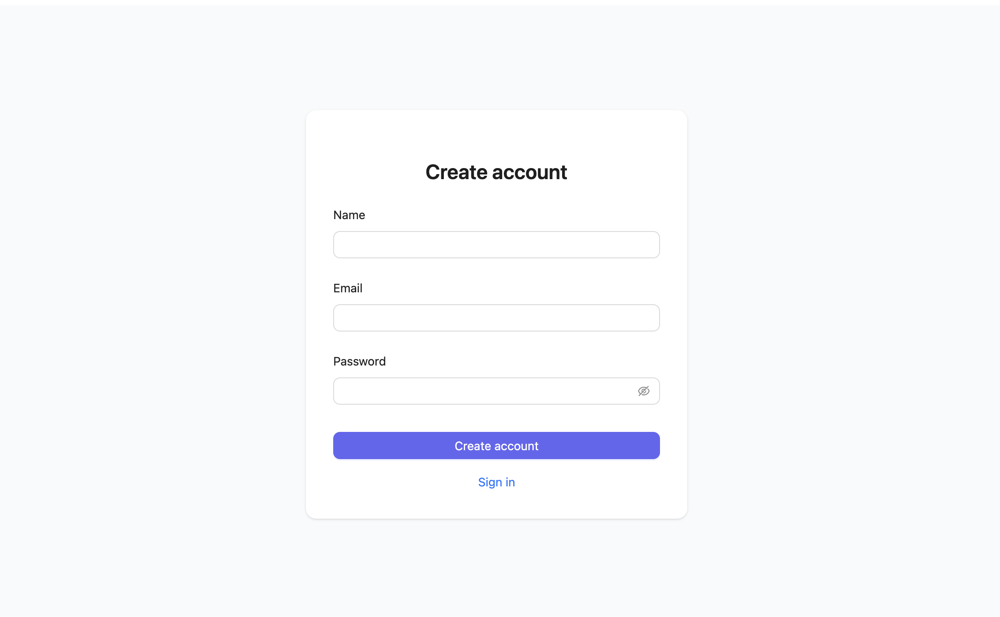

# Bookmark Manager

A fullstack SaaS for saving, organizing, and searching bookmarks — built as a portfolio project to demonstrate production-grade fullstack engineering across the entire stack.

When a URL is saved, the backend automatically scrapes its metadata (title, description, cover image, favicon) so the user never has to type anything manually.

> Inspired by [Pocket](https://getpocket.com) and [Raindrop.io](https://raindrop.io).

---

## Screenshots

| Dashboard | Add bookmark |
|-----------|-------------|
|  |  |

| Favourites | Bin |
|-----------|-----|
|  |  |

| Sign in | Create account |
|---------|---------------|
|  |  |

---

## Tech Stack

### Frontend — `apps/web`

| | |
|---|---|
| **Framework** | Next.js 15 (App Router) |
| **UI** | Ant Design 5 + Tailwind CSS 4 |
| **Server state** | TanStack Query |
| **Client state** | Zustand |
| **HTTP** | Axios with automatic JWT refresh interceptor |
| **Validation** | Zod (shared with backend) |
| **Tests** | Vitest + React Testing Library |

### Backend — `apps/api`

| | |
|---|---|
| **Framework** | NestJS 11 |
| **Database** | PostgreSQL via Prisma ORM |
| **Auth** | Passport.js + JWT (httpOnly cookies, refresh token rotation) |
| **Search** | PostgreSQL full-text search (`tsvector` / `tsquery`) |
| **Scraping** | Cheerio + native fetch (OG tags, Twitter Cards, JSON-LD) |
| **Validation** | Zod global pipe |
| **Rate limiting** | `@nestjs/throttler` |
| **Tests** | Jest |

### Monorepo — `packages/`

| | |
|---|---|
| **Build system** | Turborepo + pnpm workspaces |
| **`types`** | Zod schemas shared between FE and BE — single source of truth for validation |
| **`config`** | Shared TypeScript and ESLint config |

---

## Features

- **Automatic metadata scraping** — paste a URL and get title, description, cover image, and favicon automatically. Reads Open Graph, Twitter Cards, and JSON-LD.
- **Full-text search** — PostgreSQL native search across title, description, and URL. No external service.
- **Collections** — organize bookmarks into named collections.
- **Favourites** — mark bookmarks for quick access.
- **Soft delete + Bin** — deleted bookmarks go to a bin and can be restored or permanently deleted.
- **JWT auth with refresh** — short-lived access tokens (15 min) + long-lived refresh tokens (7 days) stored in httpOnly cookies.
- **Duplicate detection** — adding an already-saved URL returns a clear error instead of creating a duplicate.

---

## Architecture Highlights

**Zod as shared validator** — schemas live in `packages/types` and are imported by both apps. A field rule change propagates automatically to both FE validation and BE pipes without duplication.

**SSRF protection** — the scraper resolves hostnames via DNS before fetching and blocks requests to private/reserved IP ranges (`10.x`, `172.16–31.x`, `192.168.x`, `169.254.x`, loopback). Prevents internal service exposure via user-supplied URLs.

**Atomic ownership checks** — mutations (`update`, `softDelete`, `restore`, `permanentDelete`) use `updateMany`/`deleteMany` with `where: { id, userId }` instead of a separate ownership query, eliminating TOCTOU race conditions and reducing DB round-trips.

**Refresh token race condition** — a shared `refreshPromise` in the Axios interceptor ensures that concurrent 401 responses trigger only one refresh call, avoiding token invalidation loops.

---

## Local Development

### Prerequisites

- Node.js 20+
- pnpm 8+
- PostgreSQL 14+

### Setup

```bash
# 1. Clone and install
git clone https://github.com/your-username/bookmark-manager.git
cd bookmark-manager
pnpm install

# 2. Configure environment
cp apps/api/.env.example apps/api/.env
# Edit apps/api/.env and set DATABASE_URL and JWT_SECRET

# 3. Run migrations and seed data
pnpm --filter=api db:migrate
pnpm --filter=api db:seed

# 4. Start everything
pnpm dev
```

App runs at:
- **Frontend** → http://localhost:3000
- **API** → http://localhost:3001/api
- **Health check** → http://localhost:3001/api/health

### Docker (alternative)

```bash
docker compose up
```

This starts PostgreSQL, runs migrations, and boots both apps.

### Useful commands

```bash
pnpm test          # run all tests (Jest + Vitest)
pnpm build         # build all packages and apps
pnpm lint          # lint all packages

pnpm --filter=api db:studio    # open Prisma Studio
pnpm --filter=api db:migrate   # run new migrations
```

---

## Project Structure

```
apps/
  web/          → Next.js 15 frontend
  api/          → NestJS 11 REST API
packages/
  types/        → Zod schemas (shared FE + BE validation)
  config/       → tsconfig and ESLint base configs
assets/
  demo/         → Screenshots
```

---

## Deployment

| Service | Platform |
|---------|----------|
| `apps/web` | Vercel |
| `apps/api` | Railway |
| PostgreSQL | Railway (managed) |
| CI/CD | GitHub Actions — lint + test + build on every PR |
